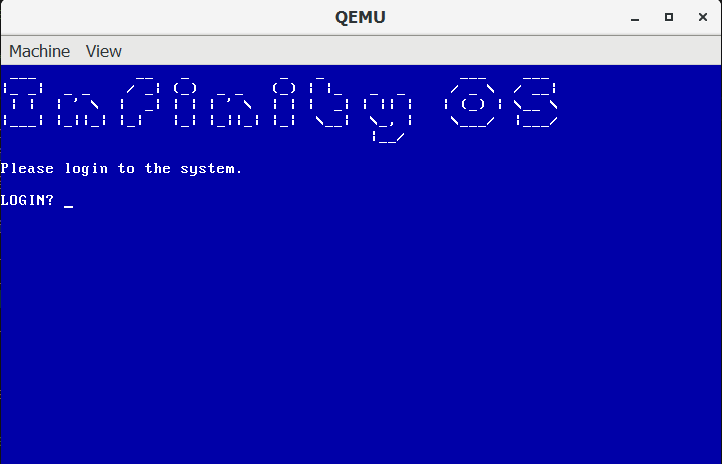
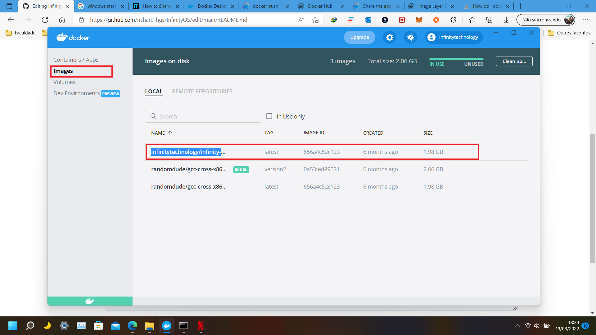
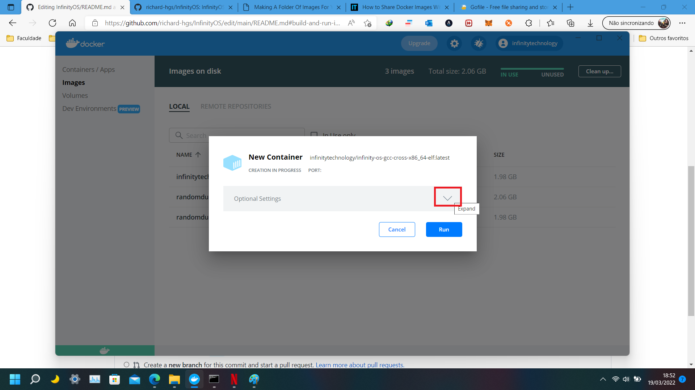
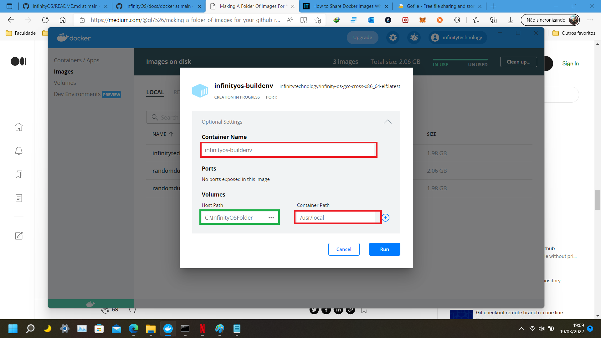

# InfinityOS
InfinityOS - Simplest Operating System Kernel

## Small Two Stage Bootloader and C Kernel

I know a lot about 16 real mode and boot sectors but not everything about it. I
am doing this small project to learn even more, after all knowledge is power. This
project will show you how to write a two stage boot loader written in NASM (Net-wide Assembler), also with a simple kernel
written in pure C.

### Screen Shots  

### Configuring Development Workspace/Environment - WINDOWS / VSCode
- 1º Install Docker and make the first steps in Doker main page;
  [Download and Install Docker Desktop](https://www.docker.com/products/docker-desktop/)
- 2º Build the container image:
     - Open a terminal in project folder and run the following command:
      
     
      docker build -t infinitytechnology/infinity-os-gcc-cross-x86_64-elf -f DockerFile .
     
- 3º The image will appear in the Container Image list

    
    
- 4º Move the mouse over the "infinitytechnology/infinity-os-gcc-cross-x86_64-elf" container image and click in run button

    
    
- 5º The configuration screen will poup. Click in Expand button.

    
    
- 6º Put the following values in the fields:
    - Container Name: 
        
          infinityos-buildenv
        
    - Container Path: 
 
          /user/local
        
    - Host Path: C:\InfinityOS_Project_Folder_Path
    - OBS: Don't change the Container Name/Path because of internal automation to fast start, build and run kernel;

      Host Path: Is the path to your project folder downloaded.
      
      After all configuration click in "Run" button.

  
    
- 7º Stop the execution of the created container app by clicking in "Stop" button.
  OBS: This step is required because of internal automation to fast start, build and run kernel;
  
  

- 8º Optional - If you are using VSCode, In root project folder go to .vscode/c_cpp_properties.json
    - Change the "compilerPath" to your cygwin path to provide context for library importations and autocomplete.

      Example: "compilerPath": "C:/cygwin64/bin/gcc.exe"

- 9º QEMU - To test the compiled operating system we will need a virtual machine. [Download and Install QEMU](https://www.qemu.org/download/)

- 10º If you did everything right the compilation process and test will work at first try.

### Build and Run

- 1º VSCode: If you are using VSCode you can run the build task using the keyboard shortcut: `CTRL+SHIFT+B`.

   The bootloader and kernel will compile, after that the qemu will try to open the compiled kernel under build folder, and operating system should be running by now inside QEMU.

- 2º To sign In type `root` and press enter.

### Throubleshots

- If the kernel don't compile, maybe the docker container is already running, if so this error message will appear in terminal. To fix open the container docker in system tray menu and stop the `infinityos-buildenv` container app. Then build again.

- If the kernel don't compile maybe the problem can be the It is auto generated file `docker-container-id` if so delete this file and stop container if already running. Then build again.

