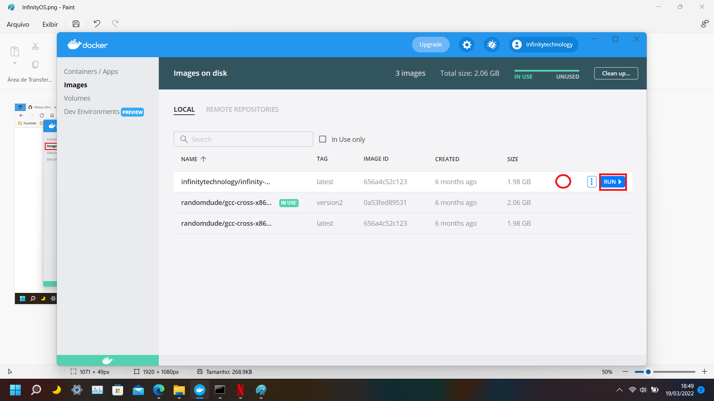

# InfinityOS
InfinityOS - Simplest Operating System Kernel

## Small Two Stage Bootloader and C Kernel

I know a lot about 16 real mode and boot sectors but not everything about it. I
am doing this small project to learn even more, after all knowledge is power. This
project will show you how to write a two stage boot loader written in NASM (Net-wide Assembler), also with a simple kernel
written in pure C.

### Screen Shots (Only posting 3 at once)

### Configuring Development Environment
- 1º Install Docker and make the first steps in Doker main page: https://www.docker.com/products/docker-desktop/;
- 2º Pull the container-image:
     
     ``docker pull infinitytechnology/infinity-os-gcc-cross-x86_64-elf``
- 3º The image will appear in the Container Image list

    
    
- 4º Move the mouse over the "infinitytechnology/infinity-os-gcc-cross-x86_64-elf" container image and click in run button

    
    
- 5º The configuration screen will poup. Click in Expand button.

    
    
- 6º Put the following values in the fields:
    - Container Name: 
        
           infinityos-buildenv 
        
    - Container Path: 
 
           /user/local
        
    - Host Path: C:\InfinityOS_Project_Folder_Path
    - OBS: Don't change the Container Name/Path beacause of internal automation to fast start, build and run kernel;

      Host Path: Is the path to your project folder downloaded.
      
      After all configuration click in "Run" button.

    

### Build and Run Instructions

 - Configuring the development workspace.

 - How to compile?
    - Run the: compile-and-run.bat
